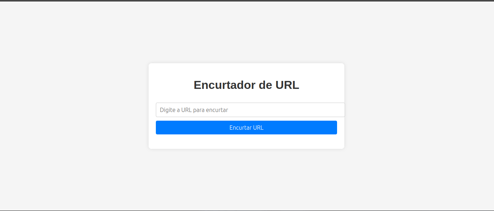
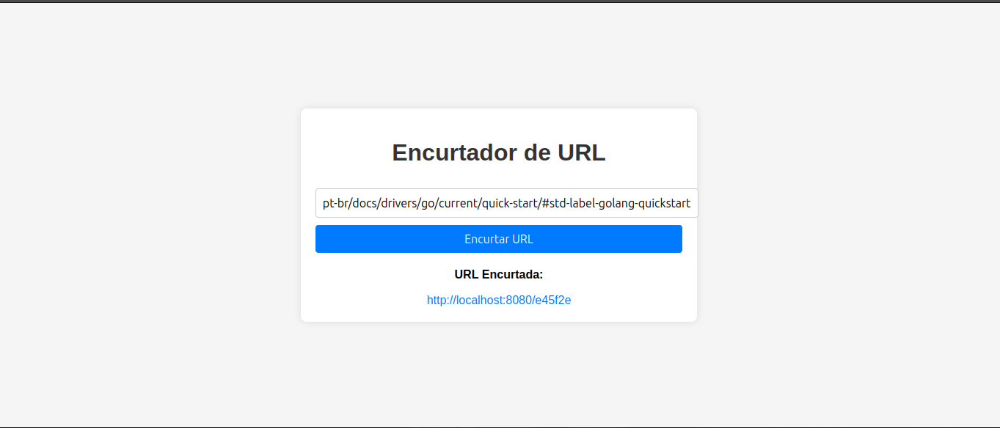

# URL Shortener

Este é um projeto de encurtador de URLs construído com **Go**, **Gin Framework**, **MongoDB** e **Docker**. O objetivo deste projeto é fornecer uma API para encurtar URLs e redirecionar os usuários para o link original a partir de um código curto gerado.

## Tecnologias Utilizadas

- **Backend**: Go, Gin Framework
- **Banco de Dados**: MongoDB
- **Frontend**: HTML, CSS, JavaScript
- **Containerização**: Docker

## Funcionalidades

- **Encurtamento de URLs**: Gera um código curto para uma URL fornecida.
- **Redirecionamento**: Redireciona o usuário para a URL original quando o código curto é acessado.
- **Persistência**: As URLs e seus códigos curtos são armazenados em um banco de dados MongoDB.

## Estrutura do Projeto

```plaintext
.
├── backend/                # Código do backend (Go, Gin)
│   ├── main.go             # Arquivo principal do servidor Go
│   ├── handlers/           # Contém funções de manipulação das rotas
│   ├── models/             # Definições de modelos de dados
│   └── database/           # Configurações de conexão com o MongoDB
├── frontend/               # Arquivos estáticos para o frontend (HTML, CSS, JS)
├── docker-compose.yml      # Arquivo de configuração do Docker Compose
├── Dockerfile              # Dockerfile do frontend
└── README.md               # Este arquivo
```

## Como Rodar o Projeto

### 1. Clonar o Repositório

Primeiro, clone o repositório para o seu ambiente local:

```bash
git clone https://github.com/m4th6us/url-shortened.git
cd url-shortener
```

### 2. Configuração do Docker

Este projeto usa o **Docker** para simplificar o processo de execução e garantir que todos os serviços estejam isolados e configurados corretamente.

#### 2.1. Subir os Containers

Use o Docker Compose para subir os containers com o comando:

```bash
sudo docker-compose up --build
```

Isso irá construir e iniciar os seguintes containers:

- **Backend** (Go + Gin)
- **Frontend** (Servidor Nginx servindo os arquivos estáticos)
- **MongoDB** (Banco de dados NoSQL)

#### 2.2. Parar os Containers

Para parar os containers em execução, utilize:

```bash
sudo docker-compose down
```

### 3. Acessar o Projeto

Após a execução dos containers, o sistema estará disponível nos seguintes endereços:

- **Frontend**: [http://localhost:8081](http://localhost:8081)
- **Backend (API)**: [http://localhost:8080](http://localhost:8080)

### 4. Testar a API

#### 4.1. Encurtar uma URL

Envie uma requisição **POST** para a API no endereço `http://localhost:8080/shorten` com o seguinte corpo JSON:

```json
{
  "original": "https://www.exemplo.com"
}
```

A resposta será um JSON contendo o **short_url**, por exemplo:

```json
{
  "short_url": "http://localhost:8080/863de3"
}
```

#### 4.2. Redirecionar para a URL Original

Quando acessar `http://localhost:8080/{codigo}`, o usuário será redirecionado para a URL original associada ao código.

Exemplo: `http://localhost:8080/863de3`

## Imagens do Projeto

### Frontend

#### Exemplo de Interface 



#### Exemplo de Encurtamento de URL

